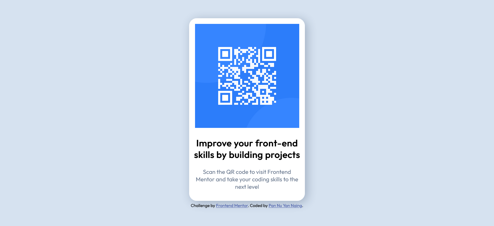

# Frontend Mentor - QR code component solution

This is a solution to the [https://www.frontendmentor.io/challenges/qr-code-component-iux_sIO_H]. Frontend Mentor challenges help you improve your coding skills by building realistic projects. 

## Table of contents

- [Overview](#overview)
  - [Screenshot](#screenshot)
  - [Links](#links)
- [My process](#my-process)
  - [Built with](#built-with)

## Overview

I made a responsive card with QR image in it with pure HTML and CSS here.

### Screenshot

### Links

- Solution URL: [https://www.frontendmentor.io/solutions/responsive-qr-card-with-pure-html-and-css-bvIu4n3MLf]
- Live Site URL: [https://pannuyn.github.io/Responsive-QR-Card/]

## My process

### Built with

- Semantic HTML5 markup
- CSS custom properties
- Flexbox
- CSS Grid

